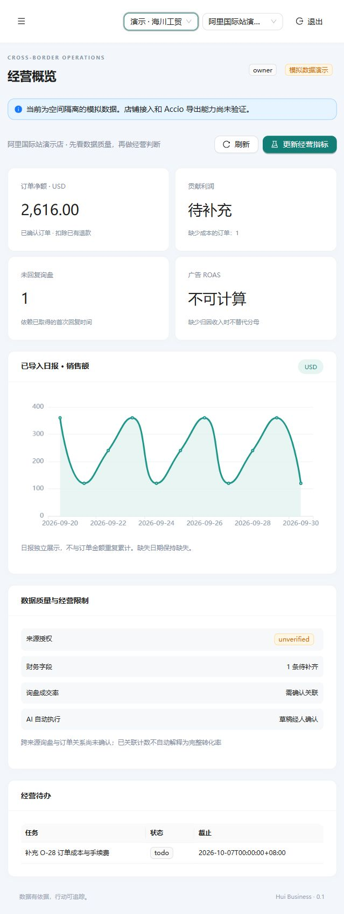

# Zeabur 部署记录与操作说明

2026-10-05 已部署试用版：[打开工作台](https://hui-business-sakuralaaa.zeabur.app)。项目为 `hui-business`，运行在用户指定的唯一 ZeaburOS 托管服务器上。服务器实际架构为 ARM64。

管理员登录资料保存在本地 `data/zeabur-login.txt`，文件已忽略 Git 并限制为当前 Windows 用户访问。Zeabur 认证由 CLI 的用户配置管理，API Key 不进入代码、镜像、模板或本文档。

## 镜像与服务

本次应用镜像标签固定为 `aeb1410141fbac2ec698bb86a4a74df85863bbdb`，包含分别通过启动验证的 AMD64、ARM64 镜像。构建与镜像验证在 [GitHub Actions](https://github.com/Sakuralaaa/hui-business/actions/runs/37220336428) 完成。本机没有构建或运行测试。

| 服务 | 用途 | 持久保存 |
|---|---|---|
| `web-runtime` | 网页与 API 反向代理，唯一公网 HTTPS 入口 | 网页来自固定镜像 |
| `api-runtime` | 登录、业务接口、上传与确认 | 数据库及私有 S3 |
| `worker-runtime` | 解析、预览和经营分析 | PostgreSQL 持久任务 |
| `postgresql` | 官方 PostgreSQL 18 模板 | 官方数据库卷 |
| `rustfs` | RustFS 1.0.1，兼容 S3 的原件存储 | `/data` 卷 |
| `database-backup` | 每次启动及每 24 小时生成数据库归档 | 独立 `/backups` 卷 |
| `originals-backup` | 每次启动及每 24 小时复制新增原件 | 独立 `/backups` 卷 |

API、Worker、数据库、存储及备份服务没有绑定公网域名；数据库 TCP 转发已禁用。API 与 Worker 使用不同的数据库角色。

API 与 Worker 的 `/tmp/hui-objects` 是临时解析及下载目录，原件由 RustFS 保存。重启不会删除已封存的原件或已确认数据；中断中的文件需由上传程序重传，原件封存后可以重新下载解析。

Zeabur 官方 MinIO 模板在本次环境拉取镜像时返回 401，改用了 RustFS。首次模板对初始化卷的 `mountPath` 没有正确传递，API/Worker 的最终部署去除了这一挂载依赖。失败的旧 `minio`、`api`、`worker`、`web` 条目已暂停；它们不是当前运行入口。初始化 `bootstrap` 验收完成后暂停，保留供管理员审查迁移时使用。更新时使用上表服务及 `CLAUDE.md` 的既有 ID。

## 首次部署与升级

`deploy/zeabur/` 提供存储、应用、备份模板，以及对应的初始化与验证脚本。它们适用于新的空项目；在已初始化项目反复部署模板可能创建重复服务。

1. 在目标服务器所属 region 创建项目，部署官方 PostgreSQL 模板 `B20CX0` 并禁用 TCP 转发。
2. 部署 `storage.yaml`。该文件取自官方 RustFS 模板 `7FG0WI`，去掉公网域名并固定镜像版本。
3. 部署 `application.yaml`，提供加密密钥、公开 origin、API/Worker 两个数据库密码及管理员账号。数据库密码采用 24 字节随机数的 48 位十六进制表示，加密密钥采用 32 字节随机数的 64 位十六进制表示。
4. 检查 `bootstrap` 输出 `HUI_BOOTSTRAP_COMPLETE`。初始化脚本安装 schema 和企业策略、设置独立角色、创建演示企业与原件桶。API/Worker 最终模板不依赖 bootstrap 的持续运行。
5. 将 HTTPS 域名绑定到 `web-runtime`；`PUBLIC_URL` 与实际 origin 一致，`COOKIE_SECURE=true`。
6. 部署 `backups.yaml`，确认首次备份和恢复检查成功，然后暂停 `bootstrap`。

已有服务升级使用 `npx zeabur@latest service update tag --id <既有服务ID> -t <通过 CI 的固定提交标签> -y -i=false`。API、Worker、Web 保持同一提交版本；先备份再升级。数据库 schema 改动必须提供经过审查的迁移，不能对真实数据库运行 `db push`。

## 本次线上验收

验证脚本 `verify.cjs` 在云端 bootstrap 容器执行，只写入演示企业，没有读取真实店铺，也没有调用付费模型。

- HTTPS、浏览器管理员登录及三个企业可用。
- 任务专用凭据上传模拟 CSV，S3 封存、Worker 解析与预览正常。
- 确认入库与重复确认的幂等行为正常。
- 下载原件的 SHA-256 与上传文件一致。
- 切换另一个演示企业读取批次返回 404。
- 后台确定性经营分析完成，上传凭据撤销成功。
- 数据库归档恢复到隔离的临时数据库，企业数量为 3；验证后移除临时恢复库，业务库保持运行。
- 两份验收原件已复制到独立备份卷。

最近验收批次为 `89570d8b-497e-49ca-88f2-9b687ddd0bff`，分析报告为 `c78d614b-5d05-48aa-ae51-ba3205eae67b`。

## 备份与恢复

当前 Zeabur 套餐的内置备份接口返回 `REQUIRE_PAID_PLAN`，因此使用独立备份服务，未开通付费升级。备份属于同一服务器上的独立卷，可以应对数据库或对象的误改，不能抵御整台服务器及磁盘丢失。正式经营前还需把数据库归档、原件和加密密钥复制到独立位置，并做完整恢复演练。

数据库归档路径为 `database-backup:/backups/hui-<UTC时间>.dump`，第一次恢复检查结果位于 `/backups/restore-verified.txt`。原件副本在 `originals-backup:/backups/objects/`，最近成功时间与数量在 `/backups/objects-status.json`。两类备份目前保留已有文件，不自动删除；关注服务器磁盘占用。

每个备份服务从启动完成后按 24 小时间隔运行，重启会触发额外一次备份。通过各服务日志查看 `DATABASE_BACKUP_SAVED`、`DATABASE_RESTORE_VERIFIED` 和 `ORIGINALS_BACKUP_SAVED`。失败须查看日志并恢复任务，不能把服务 Running 等同于备份成功。

恢复时先暂停业务写入，再在隔离数据库用 `pg_restore` 验证归档。原件副本按原对象 key 上传回私有桶，恢复相同的 `ENCRYPTION_KEY`，核对原件哈希、业务版本、快照和模型配置后切换应用。不要在运行中的真实数据库直接覆盖恢复。

模型接口仍需用户配置；Accio 真正导出店铺原始数据和官方平台 API 权限仍待朋友环境验证。本次交付适合模拟演示和小规模试用。
